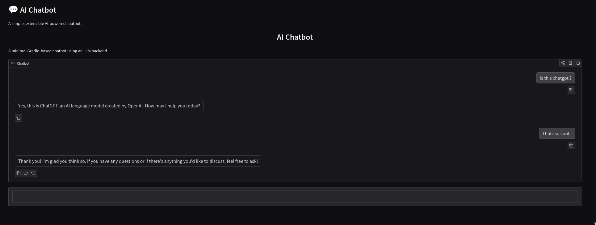

# Project 01 — AI Chatbot

A simple but extensible AI‑powered chatbot built with Python and Gradio.  
This project demonstrates how to build a clean conversational interface, integrate with modern LLM providers, and package everything in a professional, Docker‑ready structure.



--

## 🧩 Overview

This chatbot serves as a minimal but solid foundation for experimenting with AI‑driven conversational interfaces.  
It is intentionally kept small, readable, and easy to extend.

Key features:

- Web‑based chat interface using Gradio  
- Modular AI client (OpenAI, LM Studio, Ollama, etc.)  
- Optional conversation history  
- Fully containerized with Docker  
- Simple configuration via `.env`  

---


## 🧱 Project Structure

Below is the structure of this project:

```
project-01-chatbot/
│
├── app.py               # Gradio UI and chat loop
├── ai_client.py         # Handles communication with the AI provider
├── requirements.txt     # Python dependencies
├── Dockerfile           # Container build instructions
├── docker-compose.yml   # Easy one-command startup
├── .env.example         # Example environment variables
└── README.md            # This file
```

---

## ⚙️ Installation & Usage

You can run this project **locally** or using **Docker**.  
Both methods are supported and documented below.

---


## ⚠️ Python Version Notice

This project currently requires **Python 3.11 or 3.12** when running locally.

Python **3.13 is not supported** because several standard library modules (including `audioop`) were removed.  
Gradio and Pydub still depend on these modules, which causes import errors when using Python 3.13.

If you want to run the project locally, please use:

- **Python 3.11** (recommended)  
- **Python 3.12**

Docker users do not need to worry about this — the included Dockerfile uses Python 3.11 and works out of the box.

## ▶️ Running with Docker (recommended)

1. Copy the example environment file:

```
cp .env.example .env
```

2. Add your API key to `.env`:

```
OPENAI_API_KEY=your_key_here
```

3. Start the project:

```
docker compose up
```

4. Open the chatbot in your browser:

```
http://localhost:7860
```

---

## ▶️ Running locally (without Docker)

1. Create a virtual environment (optional but recommended):

```
python3 -m venv venv
source venv/bin/activate
```

2. Install dependencies:

```
pip install -r requirements.txt
```


3. Copy the environment file:

```
cp .env.example .env
```

4. Add your API key to `.env`.

5. Start the app:

```
python app.py
```

The chatbot will be available at:

```
http://localhost:7860
````
---

## 🧠 Configuration

All configuration is handled through environment variables.

Example:

```
OPENAI_API_KEY=your_key_here
MODEL=gpt-4o
```

You can extend this with:

- custom model names  
- local model endpoints  
- logging options  
- history settings  

---

## 📌 Development Status

**Status:** In Progress  
This project is actively being built.  
See the TODO list below for planned features.

---

## 📝 TODO

- [ ] Build the base Gr
